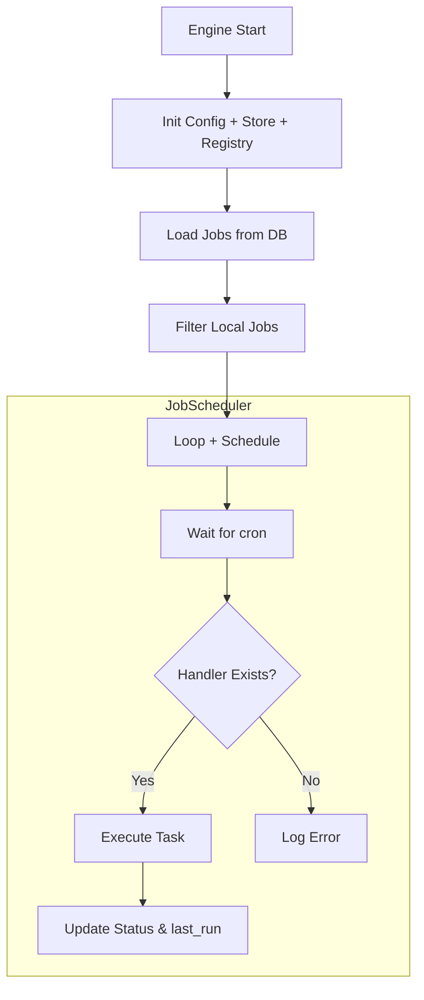

# NiX Scheduler-Engine

## Enterprise-Grade Job Scheduler Engine in Rust

NiX Scheduler-Engine is a high-performance, enterprise-ready job scheduling engine written in Rust ✨. It follows Clean Architecture principles and supports cron expressions, priority timer wheel, multi-shard execution, and a pluggable task system.

Now includes secure **login via Microsoft Entra ID (OIDC)** and seamless integration with Azure services like Azure Data Factory (ADF).

---

## 🛠 Features

- ✅ Cron Expression Scheduling (`cron` crate)
- ✅ Priority Timer Wheel (`BinaryHeap + tokio`)
- ✅ Pluggable Task System (HTTP, Shell, Print, WASM-ready)
- ✅ Local and Distributed Sharding
- ✅ SQLite Job Store (PostgreSQL-ready)
- ✅ Compile-time SQL validation (`sqlx`)
- ✅ Login with Microsoft Entra ID (OpenID Connect)
- ✅ Web Dashboard UI (HTML + JS)
- ✅ Federated Logout
- ✅ Secure Cookie and Session Management

---

## 🧱 Project Structure

```text
src/
├── main.rs                # Entry point
├── config.rs              # Application configuration / DI
├── engine/                # JobEngine orchestration logic
├── job/                   # Job model and database
├── scheduler/             # Priority timer wheel and tick loop
├── shard/                 # Local and distributed sharding logic
├── task/                  # Task handler implementations and registry
├── auth/                  # OIDC login, callback, logout handlers
├── web/                   # Actix Web API routes and frontend
```

---

## 📦 Quick Start

```bash
# Clone the project
git clone https://github.com/preedep/nixscheduler-engine.git
cd nixscheduler-engine

# Run using SQLite
cargo run
```

### 🧪 Sample `.env` (non-secret values)

```env
# Scheduler mode: local or distributed
SHARD_MODE=local
SHARD_ID=0
TOTAL_SHARDS=4

# Database configuration
DATABASE_URL=sqlite://./data/jobs.db
TICK_INTERVAL_SECS=1

# ADF Integration (service principal auth)
AZURE_CLIENT_ID=<your-client-id>
AZURE_TENANT_ID=<your-tenant-id>
AZURE_CLIENT_SECRET=<your-client-secret>

# Microsoft Entra ID (OIDC)
OIDC_CLIENT_ID=<your-client-id>
OIDC_REDIRECT_URI=http://localhost:8888/auth/callback
OIDC_AUTH_URL=https://login.microsoftonline.com/<your-tenant-id>/oauth2/v2.0/authorize
OIDC_SCOPES=openid profile email

# Login page URL
APP_LOGIN_URL=http://localhost:8888/login.html
```

> ⚠️ **Do not include secrets like `AZURE_CLIENT_SECRET` or `OIDC_CLIENT_SECRET` in public repos.** Use `.env` or a secure secrets manager.

---

## 📌 Architecture Diagram

### 🔧 Core Flow



---

## 💡 Job Table Schema

```sql
CREATE TABLE jobs (
    id TEXT PRIMARY KEY,
    name TEXT NOT NULL,
    cron TEXT NOT NULL,
    task_type TEXT NOT NULL,
    payload TEXT,
    last_run TEXT
);
```

### Example Job

```json
{
  "id": "job-hello",
  "name": "print-hello",
  "cron": "* * * * * * *",
  "task_type": "print",
  "payload": "Hello, NiX!",
  "last_run": null
}
```

---

## 🔌 Add Custom Task

1. Implement the `TaskHandler` trait.
2. Register your task in the registry.

```rust
registry.register(MyCustomTask {});
```

---

## 🛰 Example: Create Azure ADF Job via `curl`

```bash
curl -v -X POST http://localhost:8888/api/jobs   -H "Content-Type: application/json"   -d '{
    "name": "Task-ADF-LogicAppSuccess",
    "cron": "0 */1 * * * *",
    "task_type": "adf_pipeline",
    "payload": "{ \"subscription_id\": \"9d3ff024-cfad-4108-a098-8e675fbc4cc4\", \"resource_group\": \"RG-SG-NICKDEV001\", \"factory_name\": \"MyNICKADF001\", \"pipeline\": \"logic-app-success\", \"parameters\": { \"message\": \"Hello, World!\" } }"
}'
```

---

## ✅ Roadmap

- [ ] Task Retry and Timeout Policy
- [ ] WASM Plugin Runtime Support
- [ ] REST API (via Actix or Axum)
- [ ] Enhanced UI Dashboard
- [ ] Clustered Leader Election (via etcd or Redis)

---

## 🧑‍💼 Authentication & Login Flow

- Microsoft Entra ID (OIDC) Login
- Nonce + State CSRF Protection
- `id_token` validation via JWKS
- Federated Logout (`end_session_endpoint`)
- Frontend login page with redirect support

---

## 🛡 Security Notes

- Secure cookies (`HttpOnly`, `Secure`)
- Login required to access dashboard and APIs
- `.env` should be excluded from version control

---

## 📜 License

MIT

---

> ⭐ Star this repository if you find it useful. Contributions welcome!